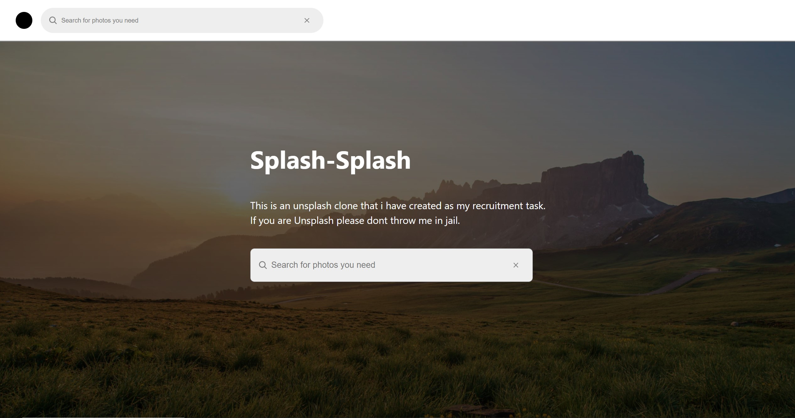
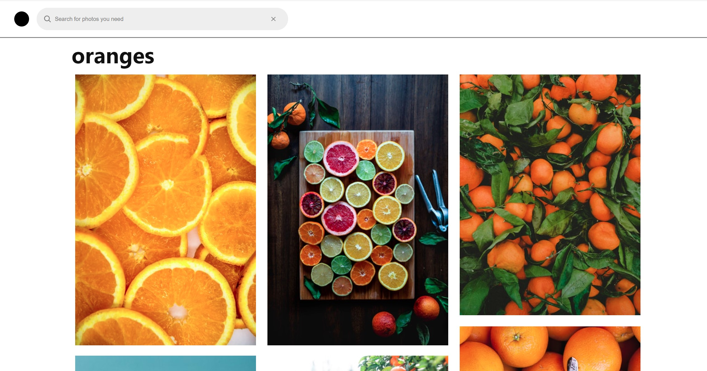

## Scripts

pls use npm for instalation of the packages:

### 'npm install'

to run the app on the localhost:3000 use this command:

### 'npm run start'

## Quick note:

please note that this application will not work properly if you will not provide a:

### `APIkeys.tsx`

the file should be placed in the src folder and should be a named export of your Unsplash AccessKey:

### 'export const AccessKey="your_turbo_ultra_mega_secure_key"

## About App

It is a symplistic clone of Unsplash.com using unsplash api.
the app consists of two pages:

### Landing

### Photos

